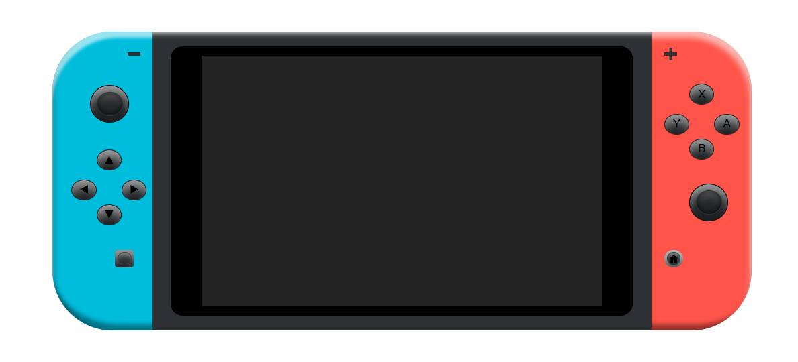

### PROYECTO VIDEOCONSOLA NINTENDO SWITCH.




## Descripción.

```bash

Proyecto para Geekshubs. Diseño de una videoconsola Nintendo Switch.
```

## Tecnologías usadas.

```python

- HTML
- CSS

```

## Como visualizar el proyecto.

Solo debes ingresar en el siguiente enlace 

## License

[MIT](https://choosealicense.com/licenses/mit/)
